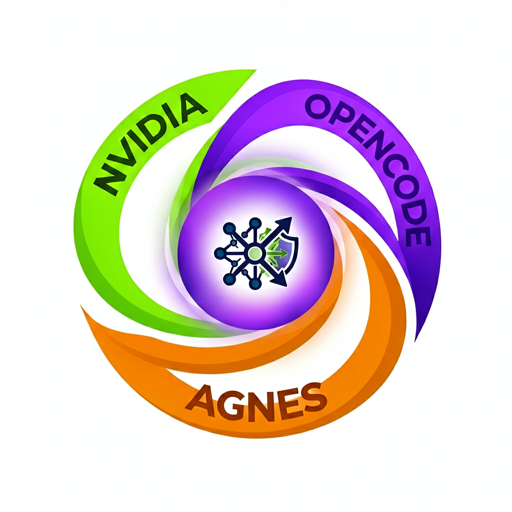

# AI Proxy Gateway

<p align="center">
  
</p>

<p align="center">
  <a href="https://github.com/BerriAI/litellm"></a>
  <a href="https://claude.com/product/claude-code"></a>
  <a href="https://opencode.ai"></a>
  <a href="https://www.docker.com/"></a>
</p>

A proxy gateway that routes **Claude Code** through **LiteLLM** (Python) to multiple AI backend providers with load balancing and parameter normalization.

## Features

- **Multi-provider routing**: Access NVIDIA NIM, OpenCode Zen, and Agnes AI through a single endpoint
- **Load balancing**: Distributes requests across multiple NVIDIA API keys using `simple-shuffle` strategy
- **Automatic fallbacks**: Models like `mimo-v2.5` automatically fallback to `agnes-2.0-flash` on failure
- **Parameter normalization**: Drops unsupported parameters (`drop_params: true`) for cross-provider compatibility
- **Anthropic compatibility**: Routes all providers via `/v1/chat/completions` endpoint for seamless Claude Code integration
- **Dockerized**: Uses official LiteLLM image for consistent deployment
- **Secure**: API keys managed exclusively via environment variables

## Prerequisites

- [Docker Desktop](https://docs.docker.com/get-docker/) or Docker Engine
- [Docker Compose](https://docs.docker.com/compose/install/)
- API keys for the backends you plan to use (see `.env.example`)

## Setup

1. **Clone the repository**

   ```bash
   git clone <repository-url>
   cd litellm-proxy
   ```

2. **Configure environment variables**

   ```bash
   cp .env.example .env
   # Edit .env with your API keys:
   #   NVIDIA_API_KEY_1, NVIDIA_API_KEY_2, OPENCODE_API_KEY, AGNES_API_KEY
   ```

3. **Start the proxy**

   ```bash
   docker compose up -d
   ```

4. **Verify the service is running**

   ```bash
   curl http://localhost:4000/v1/models
   ```

## Usage

Once the proxy is running on `localhost:4000`, configure Claude Code to use it by setting these environment variables:

```bash
export ANTHROPIC_BASE_URL=http://localhost:4000
export ANTHROPIC_DEFAULT_OPUS_MODEL=mimo-v2.5
export ANTHROPIC_DEFAULT_SONNET_MODEL=nemotron-3-super
export ANTHROPIC_DEFAULT_HAIKU_MODEL=gpt-oss-120b
```

Add these to your `~/.profile` or equivalent and restart your terminal.

### Testing the Proxy

You can test the proxy directly with curl:

```bash
curl -X POST http://localhost:4000/v1/chat/completions \
  -H "Content-Type: application/json" \
  -d '{
    "model": "nemotron-3-super",
    "messages": [{"role": "user", "content": "Hello!"}],
    "max_tokens": 100
  }'
```

## Project Structure

```bash
litellm-proxy/
├── docker-compose.yml          # Docker Compose configuration for LiteLLM
├── .env                        # API keys (gitignored)
├── .env.example                # Template for environment variables
├── .gitignore
├── README.md                   # Project overview and setup instructions
└── litellm/
    └── config.yaml             # LiteLLM provider configuration
```

### Configuration Details (`litellm/config.yaml`)

- **Providers**: Configured models include:
  - `gpt-oss-120b` (NVIDIA NIM)
  - `nemotron-3-super` (NVIDIA NIM)
  - `mimo-v2.5` (OpenCode Zen)
  - `agnes-2.0-flash` (Agnes AI)
- **Load Balancing**: `simple-shuffle` strategy distributes requests across NVIDIA API keys
- **Fallbacks**: Automatic fallback chains (e.g., `mimo-v2.5 → agnes-2.0-flash`)
- **Parameter Handling**: `drop_params: true` ensures cross-provider compatibility
- **Anthropic Routing**: `use_chat_completions_url_for_anthropic_messages: true` routes all providers via `/v1/chat/completions`

## Maintenance

- **Update API keys**: Edit `.env` file as needed
- **Modify configuration**: Update `litellm/config.yaml` to add/remove providers or adjust routing
- **Apply config changes**: Requires full container restart:

  ```bash
  docker compose down && docker compose up -d
  ```

- **Update LiteLLM**: Pull latest image and recreate containers:

  ```bash
  docker compose pull && docker compose up -d
  ```

- **Monitor logs**:

  ```bash
  docker compose logs -f
  ```

## Contributing

1. Fork the repository
2. Create a feature branch (`git checkout -b feature/amazing-feature`)
3. Commit your changes (`git commit -m 'Add some amazing feature'`)
4. Push to the branch (`git push origin feature/amazing-feature`)
5. Open a Pull Request

Please ensure any changes maintain the security principle of keeping API keys in environment variables only.

## Security Notes

- API keys are stored exclusively in environment variables (`.env` file)
- The `.env` file is gitignored to prevent accidental commitment of secrets
- No secrets should ever be added to the codebase or configuration files
- Regularly rotate your API keys following provider best practices

## License

MIT
